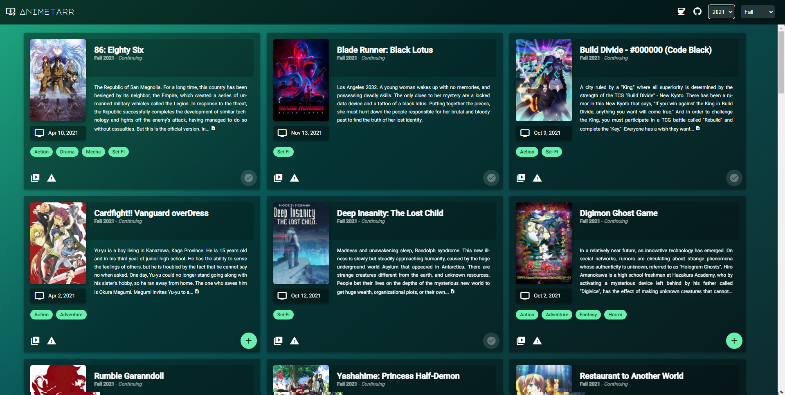

# Animetarr

[](https://GitHub.com/Naereen/StrapDown.js/graphs/commit-activity)
[](https://typescriptlang.org)
[](<[https://https://www.buymeacoffee.com/](https://www.buymeacoffee.com/kariudo)>)

Pronoucned [ˈanimādər] like "Animator", you can query scheduled or historical anime releases and add them to your Sonarr instance.

## Screenshot



## Usage (Docker)

Animetarr is available as a docker image and published to Docker Hub: `kariudo/animetarr:latest`, you will need to provide the required environment variables though.

```shell
$ docker run --name animetarr\
    -p 3000:3000/tcp \
    -e API_PORT=3000 \
    -e TVDB_API_KEY="YOURTVDBIDKEY" \
    -e SONARR_API_BASE_URL="https://sonarr.home.host.local/api" \
    -e SONARR_API_KEY="YOURSONARRAPIKEY" \
    -e SONARR_QUALITY_PROFILE_ID=3 \
    -e SONARR_BASE_PATH="/downloads/anime/"\
    -e PASSWORD="aLittleS3curity"\
    -d kariudo/animetarr:latest
```

### With Docker Compose

You can also just make a copy of the `docker-compose.template.yml` as `docker-compose.yml` to your desired location, then after updating the file with your API keys etc. you can start the container with `docker compose up`.

## Usage (Development/shell)

There are two components: the Server (nodejs server) and the UI (Angular web client). To run the development assets and/or debug:

### Start the server

You will need to make your `.env` file to reflect your settings. You can start by copying the `.env.example` file to `.env` and entering your approparite values.

```shell
$ npm start
```

### Build the client UI

The client static site content can be built with the Angular CLI.

```shell
$ cd animetarr-ui
$ ng serve --watch
```

## Now what?

After launching the client in your browser (most likely from `localhost:3000`), you should be shown the current airing season of programming. In the bottom right of each card you can press the `+` FAB to select series that should be added to your Sonarr instance. Shows that have already been added should have a disabled button and a checkmark shown in place of the button.

The bottom left corner of each card also provides a button to mark(hide) shows that are mismatched (if it's something annoying), as well as a button to search YouTube for a any video previews to help decide if the series is worth your time.

### About mismatches

So when it comes to mismatches the issue is generally that there is a missing alias in the TVDB database. When the series is down in the mismatches you can view the original title of the series we tried to search for that was expected to be found, along with the query that actually hit your incorrect match, rather than the description. A lot of times this is because there is no english translation for a show, or the romaji name is the common accepted one instead, so it may need to be added to the TVDB series tranlation aliases. Once added there, matches tend to show up correctly after their caches update. So help the community, and help yourself and add missing data.

## Descriptions on descriptions

The general descriptions come from the TVDB as well, since that is the match data we will be binding into for Sonarr. It has priority. If there is no description on the TVDB even though a match was found (this happens on new/future season shows) we will try to fall back to any data we had from AniList.

## Where does the data come from?

The scheduling information by season is pulled from the AniList graphql API, and additional supporting details are pulled from the TVDB since we need those to leverage an exact match for Sonarr.


If you have the time or find any issues, please help contribute to their database by correcting issues and filling in any missing information you find.
